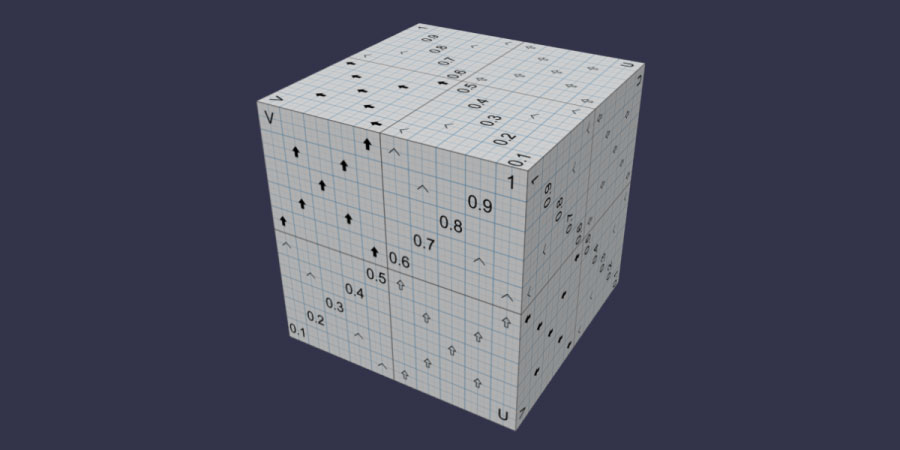

## Babylon + Next.js Starter Template

This is a production ready mono-repository setup for [Babylon.js](https://www.babylonjs.com/) using [Next.js](https://nextjs.org/) server side rendering.

It is suitable for small projects, and scales to large apps without suffering performance or ease of use.

For more details, please read this guide on how to optimize your
[Babylon + Next.js production build for SEO and Blazing Fast Page Load Speed](https://3designer.app/best/babylon-nextjs-setup)
.



### Key Features:

1. SEO Friendly
2. Load Fast to achieve “A” Grade Page Speed score
3. Async Load Babylon.js to improve UX (user experience)
4. Code Splitting with Tree Shaking to reduce bundle size
5. An option to write in pure Javascript or Typescript (or mixing both)
6. Intuitive developer experience with HMR (Hot Module Reload)
7. [Jest Test](https://jestjs.io/) working setup
8. Modular Architecture for a flexible, maintainable and scalable app
9. Production ready with detailed bundle analyzer.

### Installation & Use

This is a platform-agnostic monorepository minimum setup boilerplate.

It has been tested and works with Node.js v12.22.1.

The setup uses [Yarn Workspaces](https://classic.yarnpkg.com/lang/en/docs/workspaces/) to easily scale to different
clients (React Native for iOS, Android, Electron) or server (Node.js).

This way, you can maximize code reuse between platforms to enforce **best programming practices**.

1. Install packages

```shell
yarn
```

2. Run the app

```shell
yarn dev
```

3. Run Tests

```shell
yarn test
```

4. Build production bundle

```shell
yarn build
```

5. Run Production build locally

```shell
yarn start
```

### Beginner's Installation Guide for Mac

1. Install [Brew](https://brew.sh/) (it may ask you to install Xcode dev tools - do that first)
2. Install frontend tools

```shell
# Install Node version manager
brew install nvm

# Install latest Node.js version 12
nvm install 12

# Set Node 12 as the default version
nvm alias default 12

# Install Yarn package manager
brew install yarn

# Install Babylon Project
git clone https://github.com/ecoinomist/babylon-next.git
cd babylon-next
yarn
yarn dev
```

If `nvm` command isn’t working, you may need to add this in `.bash_profile`:

```
# Node Package Manager
export NVM_DIR="$HOME/.nvm"
source $(brew --prefix nvm)/nvm.sh
```

Then in terminal:

```shell
source ~/.bash_profile
```

### Windows Notes

Windows users should install this template using `yarn`, not `npm` because it will probably produce errors with npm.

If you haven’t installed yarn, do this first:

```shell
# it doesnt work if using npm install --global yarn (according to some people)
npm i yarn
```

### Folder Structure

- **/repos/core**: common code to be shared across platforms (web, iOS, Android, Desktop, backend API, devOPs, etc.)
- **/repos/client**: common frontend code to be shared across platforms (i.e. if you create a reusable Babylon Camera
  React component, put it here, because Camera, and most Babylon rendering, will likely to be used in client side only)
- **/repos/web**: specific client release for the ‘browser’ using Next.js. In a similar fashion, you can create a
  sibling `ios` or `android` folder using [React Native](https://reactnative.dev/), and they each only contain code related to that release.
